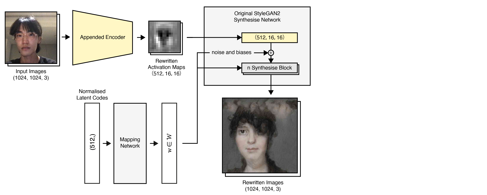

###### Coding Three: Exploring Machine Intelligence   
# Rewriting Activation Maps

  

**An Encoder Network that Enables a Pre-trained StyleGAN2 Model to Perform Image-to-image Translation**  
Jasper Zheng (Shuoyang) / 21009460  

This project proposed a novel training system appended to [StyleGAN2](https://github.com/NVlabs/stylegan2) architecture, enabling a pre-trained StyleGAN2 model to perform image-to-image translation, even if the input images are not in the original domain. The training system is based on an encoder network that downscales the generated images from a StyleGAN2 model and matches the distribution of the earlier activation maps in the same model (i.e. predict feature maps given a generated image). After training, the encoder network is migrated to the StyleGAN2 model.   

The proposed system was implemented on a couple of pre-trained models. And the results showed that it's able to create meaningful image-to-image translation different with [pix2pixHD](https://github.com/NVIDIA/pix2pixHD) and other state-of-the-art image translation models.  

In addition, a real-time interactive system was built to facilitate human control of the network.   

###### Real-time Inference (high-resolution 1024x1024)  

https://user-images.githubusercontent.com/74963879/174460792-5df1c0f0-763a-44ff-8894-cc5859dd5191.mp4  

###### Rendered Inference   

https://user-images.githubusercontent.com/74963879/174490605-5373091c-1b51-45cb-9300-d3c756310823.mp4  

## Related Study and Motivation  

In addition to improving the model performance and quality, modern approaches also focus on manipulating the trained network to produce outputs that are diverse from the original dataset.  

A previous study on [StyleGAN Encoder](https://github.com/eladrich/pixel2style2pixel) demonstrated a variety of facial image-to-image translation tasks, which encode real images into extended latent space W+. 

[Model Rewriting](https://github.com/davidbau/rewriting) showed that editing a network's internal rules allows us to map new elements to the generated image intentionally.

[Network Bending](https://github.com/terrybroad/network-bending) showed that the transformations of spatial activation maps in GANs could create meaningful manipulations in the generated images. 

Both of these works indicated that the knowledge encoded in a deep neural network is semantically related to the spatial information in its feature maps. And manipulating this information can create results diverse from the original domain. Therefore, we asked:  
 * Could we introduce an additional network to learn the spatial distribution of information in a specific layer in a trained GAN model? 
 * And with this additional network, if we could directly generate feature maps from a given real image and create image-to-image translation?  

## Appended Encoder Network  

The method is based on the hypothesis that if we can reversely downscale a generated image into activation maps in an earlier synthesise layer, we are able to reproduce the same generated image.  

</img>  
Figure 01: Training the Encoder  

As shown in Figure 01, the training system takes the output images from a StyleGAN2 model as the encoder's input. The encoder downscales the images to rewritten activation maps, which are then compared with a specific layer of intermediate activation maps extracted during StyleGAN2 inference. The loss is calculated by the pixel Euclidean Distances between the real activation maps and the rewritten activation maps. 

</img>  
Figure 02: Deploy the Encoder  

As shown in Figure 02, after the encoder is trained, it is migrated to replace the synthesise block before the specific layer. The assembled system takes images as input, and translates the images into the domain of the original StyleGAN2 model.  

## Results  

###### Network appended to model trained on [FFHQ](https://github.com/NVlabs/ffhq-dataset)   

<table> 
  <tr>
    <td> </td>
    <td> </td>
    <td> </td>
  </tr>
</table>   

###### Network appended to model trained on [Frea Buckler artwork](https://twitter.com/dvsch/status/1255885874560225284)  

<table> 
  <tr>
    <td> </td>
    <td> </td>
    <td> </td>
  </tr>
</table>  

###### Network appended to model trained on [MetFaces](https://twitter.com/ak92501/status/1282466682267676675)  

<table> 
  <tr>
    <td> </td>
    <td> </td>
    <td> </td>
  </tr>
</table>  

###### Network appended to model trained on [A Database of Leaf Images](https://data.mendeley.com/datasets/hb74ynkjcn/1)  

<table> 
  <tr>
    <td> </td>
    <td> </td>
    <td> </td>
  </tr>
</table>   

## Compare with Other Image-to-Image Models  

Different from [CycleGAN](https://arxiv.org/abs/1703.10593) and [Pix2Pix](https://github.com/NVIDIA/pix2pixHD), our method can be migrated to most of the pre-trained StyleGAN2 models without any extra data. However, this method restricted the input images to domains that are similar to the pre-trained model. For example, an eye is generated only if the input image has an element that looks like an eye.  

Besides, the latent vectors still function after the StyleGAN2 model is appended with the migrated encoder. Therefore, one input image may have different output depending on the latent vector, and it can perform latent space walking during the real-time inference.  

## Future Study  

The current stage of the project only tested the proposed training system on limited layers (i.e. after the 16x16 synthesise block) in a few trained models (i.e. [Frea Buckler artwork](https://twitter.com/dvsch/status/1255885874560225284), [MetFaces](https://twitter.com/ak92501/status/1282466682267676675), [FFHQ](https://github.com/NVlabs/ffhq-dataset), [A Database of Leaf Images](https://data.mendeley.com/datasets/hb74ynkjcn/1)). Future studies might scale up the experiments on different layers in different networks. They might also focus on testing the training system with different settings, or inserting jittering layers and mean filter layers to improve the output quality.  

## Implementation References  

#### Requirements  

 * tensorflow==2.3.0  
 * tensorflow-addons==0.13.0  
 * numpy==1.19.0  

#### Resources  

 * The StyleGAN2 implementation borrowed heavily from [moono/stylegan2-tf-2.x](https://github.com/moono/stylegan2-tf-2.x)     
 * Pre-trained StyleGAN2 Models: [Awesome Pretrained StyleGAN2](https://github.com/justinpinkney/awesome-pretrained-stylegan2)   
 * Self-trained StyleGAN2 Model on Leaf Dataset: [A Database of Leaf Images](https://data.mendeley.com/datasets/hb74ynkjcn/1)   
 * Real-time implementation utilising [Colab's Python to Javascript APIs](https://colab.research.google.com/notebooks/snippets/advanced_outputs.ipynb)  
